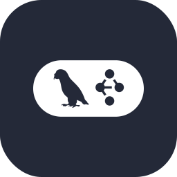

  

## 🛠️ Skills

  <table border="0" cellspacing="0" cellpadding="6">
    <tr>
      <td valign="middle" width="200"><strong>💻 Languages:</strong></td>
      <td valign="middle">
        
        
        
        
        
        
      </td>
    </tr>
    <tr>
      <td valign="middle" width="200"><strong>🎨 Frontend:</strong></td>
      <td valign="middle">
        
        
        
        
        
        
        
      </td>
    </tr>
    <tr>
      <td valign="middle" width="200"><strong>⚙️ Backend:</strong></td>
      <td valign="middle">
        
        
        
        
        
        
      </td>
    </tr>
    <tr>
      <td valign="middle" width="200"><strong>🗄️ Databases:</strong></td>
      <td valign="middle">
        
        
        
        
        
      </td>
    </tr>
    <tr>
      <td valign="middle" width="200"><strong>☁️ Cloud &amp; DevOps:</strong></td>
      <td valign="middle">
        
        
        
        
        
      </td>
    </tr>
    <tr>
      <td valign="middle" width="200"><strong>🤖 AI &amp; ML:</strong></td>
      <td valign="middle">
        
        
        
        
        
        
        
      </td>
    </tr>
  </table>

## 🔗 Socials

  <a href="mailto:realactioner@gmail.com" rel="noreferrer" style="display: inline-block; margin: 0 12px">
    <picture>
      <source media="(prefers-color-scheme: dark)" srcset="assets/socials/email-dark.svg" />
      <source media="(prefers-color-scheme: light)" srcset="assets/socials/email.svg" />
      
    </picture>
  </a>
  <a href="http://www.medium.com/realactioner" target="_blank" rel="noreferrer" style="display: inline-block; margin: 0 12px">
    <picture>
      <source media="(prefers-color-scheme: dark)" srcset="https://raw.githubusercontent.com/danielcranney/readme-generator/main/public/icons/socials/medium-dark.svg" />
      <source media="(prefers-color-scheme: light)" srcset="https://raw.githubusercontent.com/danielcranney/readme-generator/main/public/icons/socials/medium.svg" />
      
    </picture>
  </a>
  <a href="https://www.dev.to/realactioner" target="_blank" rel="noreferrer" style="display: inline-block; margin: 0 12px">
    <picture>
      <source media="(prefers-color-scheme: dark)" srcset="https://raw.githubusercontent.com/danielcranney/readme-generator/main/public/icons/socials/devdotto-dark.svg" />
      <source media="(prefers-color-scheme: light)" srcset="https://raw.githubusercontent.com/danielcranney/readme-generator/main/public/icons/socials/devdotto.svg" />
      
    </picture>
  </a>

