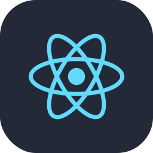



<h1 align="center">Hi 👋, I'm Real Actioner</h1>
<h3 align="center">A passionate Software Engineer & Problem Solver </h3>

 
 

 

- 🔭 8+ years in **Full Stack**, **AI**, and **Mobile Development**

- 🌱 Currently building **real-time AI systems** with **LangChain** and **OpenAI**

- 💬 Ask me about **backend optimization** and **machine learning**

- 🤖 Fun fact **If you laid all the cables in the world, they'd circle the Earth 200+ times**

 

<h3 align="left">Skills:</h3>

- Languages

  

- Frontend

  

- Backend

  

- Databases

  

- Cloud & DevOps

  

- AI / ML Core

  

- LLM & Agent Stack

  
  
  
  
  

- Mobile

  

